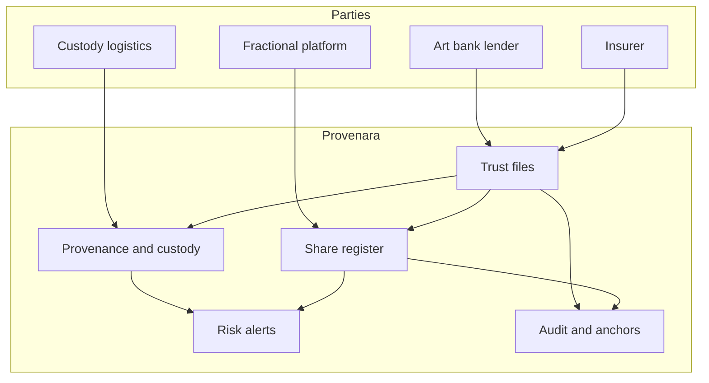

# Provenara

**Source:** `ai-in-financial/deloitte-lu-art-finance-conf-presentation-2018/`
**Domain:** `ai-fin`
**One-liner:** A trust and fractional-ownership control plane for art and alternative collectible assets that binds provenance evidence, custody events, risk scores, and investor share registers—so art-finance deals stop relying on opaque PDFs and handshake title stories.
**Wedge:** Private banks, art lenders/insurers, and regulated art-fintech platforms (Luxembourg/EU art & finance corridor) that want to offer fractional or collateralised art exposure but cannot operationalise provenance, legal title matching, and investor governance at scale.
**Positioning:** Art-finance / alternative-assets infrastructure. The Deloitte Luxembourg 11th Art & Finance Conference centres technology’s place in art: blockchain for fractional investment, law/tech challenges, risk management for market trust, and AI/big-data for analytics and experience. Provenara is the governed ledger-of-record for provenance-plus-shares—not a generic NFT mint shop and not Settora’s securities post-trade fabric.

## Market research synthesis

### Thesis from source

The conference materials argue ArtTech is digital transformation of the art business—not a buzzword collage. Themes recur across panels: **increase trust and transparency**, **data-driven valuation**, involvement of **art insurance**, and blockchain’s awkward fit (industry blockchain opportunity maps show only ~5% of opportunities related to art). Fractional investment panels ask whether shared ownership can be efficient, whether costs of trading art assets can fall, and whether trust between parties can rise—while sceptically noting that a trusted centralised application might fractionalise without blockchain, that many ventures lack art-market DNA, and that poorly governed schemes risk Ponzi-like recycling of investor capital.

Risk-management content catalogues reputation/trust threats and how technology can help: integrated risk scoring, name screening, document management, provenance data, physical-to-digital matching guarantees (exact binding between object and registry entry), custody/logistics partners, and insurers’ perspectives. AI/analytics panels target valuation support, financial decisioning, and collector experience. Investment panels examine ArtTech funding and insurer closing views. Concrete fractional patterns (e.g. digital certificates representing shares in a listed work) appear alongside governance questions on sale methods and provenance records.

Provenara’s product thesis: the scarce object is a multi-party **trust file** per artwork—provenance dossier, title/encumbrance status, custody chain, insurance posture, valuation marks, and (optional) fractional share register with investor eligibility and distribution rules—with explicit controls against mismatched physical objects and against ungoverned secondary claims.

### Buyer & economic model

- **Primary buyer:** Head of Art Banking / Lombard & Specialty Lending, or COO of an art-fintech / fractional platform; insurers and custodians as co-buyers for risk modules.
- **Users:** art advisers, registrars, compliance (AML/name screening), custody/logistics coordinators, valuation committees, investor servicing, legal counsel, insurers’ risk engineers.
- **Budget owner / value metric:** art-finance P&L and operational risk. Metrics: time to assemble a lendable/investable trust file; share of deals with complete provenance+custody packs; discrepancy rate (physical vs registry); investor distribution accuracy; insurance binding speed.
- **Competing status quo:** email PDFs of invoices and exhibition histories; spreadsheet cap tables for fractions; siloed insurer, custodian, and gallery systems; NFT experiments disconnected from legal title and insurance.

### Domain constraints

- **Regulatory / trust / safety:** securities/collective investment characterisation of fractions by jurisdiction; AML/KYC on high-value art; cultural property and sanctions; consumer/investor disclosure; anti-fraud and anti-Ponzi governance on cashflows between share classes.
- **Data sensitivity:** collector identities, valuations, location of works (theft risk), beneficial ownership of shares.
- **Change-management realities:** art market intermediaries protect opacity; technologists over-index on chain; Provenara must allow centralised trust operation with optional anchored proofs rather than forcing public-chain maximalism (aligned with the conference’s own scepticism).

## Business requirements

- BR-1: Every artwork under management must have a trust file with provenance events, current custody, and title/encumbrance status before lending or fractional offer can go live.
- BR-2: Physical object identity must be bound to the registry entry via attested custody/inspection events; unresolved mismatches block new investor subscriptions and new loans.
- BR-3: Fractional share registers must enforce eligibility, lockups, and distribution rules; circular recycling of proceeds without disclosure must be detectable as a policy breach.
- BR-4: Name screening and AML checks must gate counterparties (sellers, borrowers, investors) with auditable hits/misses.
- BR-5: Valuation marks used for LTV or NAV must cite method, date, and valuer; stale marks beyond policy expire automatically for credit use.
- BR-6: Insurance binding status must be visible on the trust file; uninsured or lapsed policies create risk alerts for lenders/platforms.
- BR-7: Secondary transfers of shares or collateral assignments must update a single share/encumbrance register—no silent bilateral side books for in-scope deals.
- BR-8: Document packs (invoices, certificates, condition reports) must be checksum-linked to trust-file events for dispute evidence.
- BR-9: Privacy: work location and collector identity are need-to-know; public marketing pages cannot leak custody coordinates.
- BR-10: Optional blockchain anchoring may attest hashes of trust-file states without requiring on-chain personal data.
- BR-11: Audit exports must reconstruct who changed provenance, custody, shares, or valuations and when.
- BR-12: Provenara does not replace gallery CRM or public auction platforms; it is the regulated trust and share control plane for finance use cases.

## User stories

Canonical user stories live in sibling [USER_STORIES.md](USER_STORIES.md).

## System design

### Overview

Provenara maintains artwork trust files, counterparty screening, valuation and insurance statuses, custody/provenance event chains, and optional fractional share registers with transfer and distribution workflows. Anchoring services may publish hashes; legal finality remains jurisdictional.

### Actors & boundaries

- **Actors:** lenders/banks, platforms, registrars, custodians/logistics, insurers, investors, compliance, valuers.
- **Trust boundary:** trust file is multi-party read with field-level ACL; public anchors carry no PII; investors see their positions, not full collector dossiers.
- **Human-in-the-loop points:** provenance dispute resolution; mismatch adjudication; valuation committee marks; fractional offer approval; suspicious cashflow reviews.

### Core capabilities

1. **Artwork trust files** — master record and ACL.
2. **Provenance and document binding** — append-only events with hashes.
3. **Custody and physical binding** — inspection/shipment attestations.
4. **Title and encumbrance register**.
5. **Counterparty AML/name screening**.
6. **Valuation marks and expiry policy**.
7. **Insurance status integration**.
8. **Fractional share register** — subscriptions, transfers, distributions.
9. **Risk scoring and alerts** — mismatches, lapses, cashflow anomalies.
10. **Optional hash anchoring and audit export**.

### Conceptual data

- **Primary entities:** Artwork, TrustFile, ProvenanceEvent, DocumentArtefact, CustodyEvent, TitleStatus, Encumbrance, Counterparty, ScreenResult, ValuationMark, InsurancePolicy, ShareClass, InvestorPosition, Transfer, Distribution, RiskAlert, AnchorReceipt, AuditExport.
- **Critical events:** trust file opened, provenance appended, custody attested, mismatch flagged, screen completed, valuation marked/expired, insurance bound/lapsed, shares issued/transferred, distribution paid, anchor published.
- **Retention / audit needs:** provenance, title, share, and distribution histories retained for long art-market and investor dispute windows; location data retained under tighter theft-risk policy.

### Integrations (conceptual)

- **Systems of record:** custody/logistics systems, insurer policy admin, bank credit systems, investor KYC providers, document vaults.
- **Upstream signals:** condition reports, shipment scans, screening list updates, valuation committee outputs, premium payment events.
- **Downstream actions:** credit limits release, subscription open/close, investor notices, insurance bind requests, audit packs.

### High-level architecture

### Success metrics

- **Leading:** % deals with complete trust files at committee; mismatch alert rate and time-to-clear; screening coverage; valuation freshness; insurance bind latency.
- **Lagging:** credit losses tied to title/provenance failures; investor distribution incidents; time-to-launch fractional offers; audit exceptions; theft/loss events with incomplete custody chains.

## OpenAPI skeleton

Canonical HTTP surface lives in sibling [openapi.yaml](openapi.yaml). Summary:

- **Base path:** `/v1/...`
- **Auth:** Bearer JWT for operators; `X-API-Key` for custody/insurer connectors.
- **Resource groups:** Artworks, Provenance, Custody, Counterparties, Valuations, Shares, Alerts, Audits.
