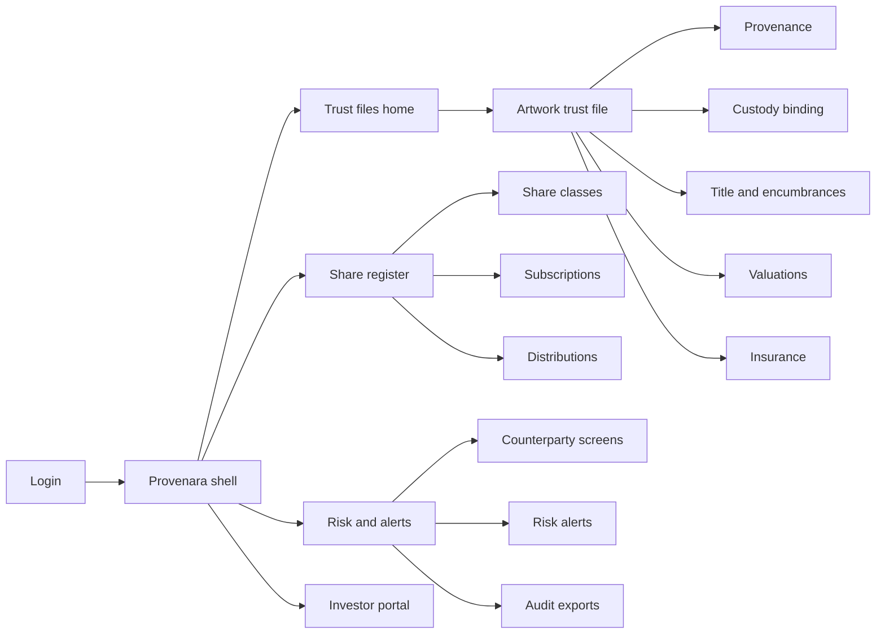
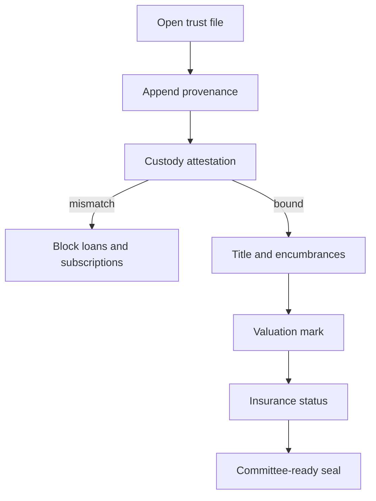
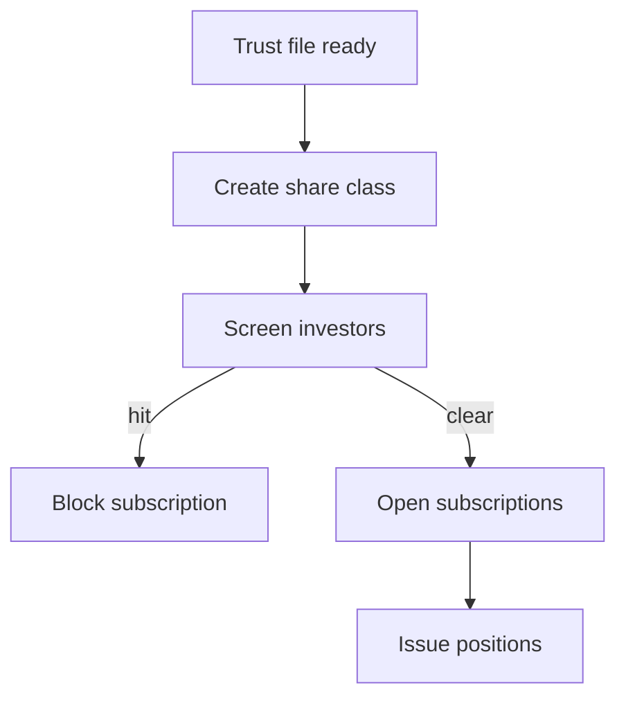

# Provenara — Web app

**Product:** [PRODUCT.md](./PRODUCT.md)
**Primary surface:** Multi-party art-finance trust console (lender / platform / registrar / insurer workspaces under one Provenara shell)
**Secondary surfaces:** Investor position portal (read-heavy share notices); optional public hash-anchor attestation page (no PII, no custody coordinates)
**Design thesis:** Provenara is a museum vault that doubles as a credit file — the UI metaphor is a sealed dossier and share register, not a gallery storefront or NFT mint wall. Visual language is archive-cream paper fields on deep oxblood and graphite: provenance rows feel append-only and archival; mismatch and insurance-lapse states feel like red seals that halt lending. The Provenara wordmark sits as a quiet registrar stamp on every trust-file and share screen so counterparties know whose governed record they are trusting.

## UX research synthesis

### Category peers (best-in-class)

- **Masterworks (investor portal):** Clear fractional position, offering docs, and distribution history without pretending to be a public auction house. Steal: investor-facing share clarity and corporate-action-like notices; reject retail “art as lifestyle” marketing chrome inside the operator console.
- **Artory / Arcual provenance rails:** Object identity bound to documented history with verification affordances. Steal: artwork-centric navigation and evidence-linked events; reject public-chain maximalism as the only trust story (conference scepticism → optional anchors only).
- **Collectrium / museum CMS patterns:** Collection objects with condition, location, and document attachments under strict ACL. Steal: need-to-know location fields and registrar workflows; reject collector social-feed aesthetics.
- **Cap table / transfer-agent UIs (e.g. Carta-like share ledgers):** Eligibility, lockups, transfers, and distributions as first-class register events. Steal: single register, no silent side books; reject startup equity jargon that does not map to art-finance share classes.

### Patterns to adopt / reject

- **Adopt:** Trust file as the home object; physical-binding status as a blocking banner; stale valuation expiry as a first-class credit gate; insurance and encumbrances on one composition; AML screen outcomes on counterparties before subscriptions; append-only provenance with checksum-linked documents; recycling/cashflow anomaly alerts as governance interventions.
- **Reject:** NFT marketplace grids as the primary IA; editable settled provenance; public maps of artwork locations; purple “AI valuation score” oracles without method/date/valuer; dashboard-of-everything that buries incomplete dossiers under vanity KPIs.

### Trust, density, and workflow constraints from PRODUCT.md

Operators need finance-and-registrar density without leaking theft-sensitive location or full collector dossiers (BR-9). Lending and fractional go-live must be blocked when provenance, custody binding, or title are incomplete (BR-1, BR-2). Fractions need eligibility, lockups, and detectable circular recycling (BR-3). Valuations expire for LTV/NAV (BR-5); insurance lapses must be impossible to miss (BR-6). Secondary transfers update one register (BR-7). Documents are evidence, not attachments-as-decoration (BR-8). Optional anchors attest hashes only (BR-10). Audit must reconstruct who changed what (BR-11).

## Information architecture

### Nav model

### Roles → default home

| Role | Default home | Why |
|------|--------------|-----|
| Art banker / lender | Trust files — lendable readiness | Committee needs complete dossier (BR-1) |
| Fractional platform operator | Share register — open offers and distributions | Eligibility and cashflow governance (BR-3) |
| Registrar / provenance analyst | Provenance queue / open trust files | Append events and clear mismatches (BR-2) |
| Compliance officer | Counterparty screens + alerts | AML gates (BR-4) |
| Insurer risk engineer | Insurance status on trust files | Bind/lapse visibility (BR-6) |
| Investor servicing | Investor portal / positions | Canonical notices (BR-7) |
| Valuation committee | Valuations on trust file | Method, date, expiry (BR-5) |

### Cross-links to OpenAPI resources

| Nav area | OpenAPI tags / resources |
|----------|---------------------------|
| Artworks / trust files | Artworks |
| Provenance | Provenance |
| Custody binding | Custody |
| Counterparties / AML | Counterparties |
| Valuations | Valuations |
| Share classes, subscriptions, distributions | Shares |
| Risk alerts | Alerts |
| Audit exports / anchors | Audits |

## Screen inventory

### Trust files home

- **Purpose:** Answer “which artworks are credit- or offer-ready?” with completeness and blocking seals visible.
- **Entry:** Post-login for lender/registrar roles; deep link from risk alerts.
- **Layout regions:** Brand + workspace switcher; readiness filters (complete / mismatch / stale mark / uninsured); artwork table (artist, title, custody bind, title status, LTV-eligible mark age, insurance); alerts rail.
- **Primary actions:** Open trust file; create artwork; export readiness for committee.
- **Empty / loading / error:** Empty = guided “open first trust file”; loading = skeleton table; error = retry with request id.
- **BR / story ties:** BR-1, BR-2, BR-5, BR-6; art lender stories.

### Artwork trust file

- **Purpose:** Single composition for provenance, custody bind, title/encumbrances, valuation, insurance — the lendable/investable dossier.
- **Entry:** From home table or search.
- **Layout regions:** Object identity header (no public location); readiness seal strip; tabs/sections for provenance, custody, title, valuations, insurance, linked share classes; ACL indicator; document pack drawer.
- **Primary actions:** Append provenance; attest custody; flag mismatch; mark valuation; refresh insurance; open share class; request audit export.
- **Empty / loading / error:** Incomplete sections show blocking checklist, not a blank void; mismatch = coral seal blocking subscriptions/loans.
- **BR / story ties:** BR-1, BR-2, BR-5, BR-6, BR-8, BR-9.

### Provenance timeline

- **Purpose:** Append-only history with checksum-linked documents for dispute evidence.
- **Entry:** Trust file → Provenance.
- **Layout regions:** Chronological event rail; document hash + artefact viewer; dispute note pane; immutability styling on committed events.
- **Primary actions:** Append event; attach artefact; open dispute on contested row.
- **Empty / loading / error:** Empty = “no provenance events — cannot go live”; validation on required fields.
- **BR / story ties:** BR-8, BR-11; registrar stories.

### Custody and physical binding

- **Purpose:** Bind physical object identity to registry via inspection/shipment attestations; clear or escalate mismatches.
- **Entry:** Trust file → Custody; alert deep link.
- **Layout regions:** Binding status banner; custody event list; inspection attestation form; mismatch adjudication pane (need-to-know location fields).
- **Primary actions:** Attest inspection; flag mismatch; clear mismatch with reason; notify lender/platform.
- **Empty / loading / error:** Unbound = block new loans/subscriptions (BR-2).
- **BR / story ties:** BR-2, BR-9; custodian and lender stories.

### Title and encumbrances

- **Purpose:** Show legal title posture and collateral assignments without silent side books.
- **Entry:** Trust file → Title.
- **Layout regions:** Title status; encumbrance register; assignment history; lender-visible flags.
- **Primary actions:** Record encumbrance; release; link to credit committee pack.
- **Empty / loading / error:** Unknown title = blocking for go-live.
- **BR / story ties:** BR-1, BR-7.

### Valuations

- **Purpose:** Marks cite method, date, valuer; stale marks auto-expire for credit use.
- **Entry:** Trust file → Valuations.
- **Layout regions:** Current eligible mark; history table; policy expiry countdown; committee notes.
- **Primary actions:** Add mark; force expire; export for LTV worksheet.
- **Empty / loading / error:** Expired = amber/coral “not usable for LTV” state, not silent hide.
- **BR / story ties:** BR-5; valuation committee and lender stories.

### Insurance status

- **Purpose:** Binding and lapse visible on the same trust composition as encumbrances.
- **Entry:** Trust file → Insurance; insurer workspace.
- **Layout regions:** Policy status; lapse alerts; custody/condition summary for bind decisions; insurer write-back of flags.
- **Primary actions:** Request bind; acknowledge lapse; open claims-relevant custody events.
- **Empty / loading / error:** Uninsured/lapsed = risk seal for lenders/platforms (BR-6).
- **BR / story ties:** BR-6; insurer stories.

### Counterparty screening

- **Purpose:** AML/name-screen outcomes gate sellers, borrowers, and investors with auditable hits/misses.
- **Entry:** Nav → Counterparties; subscription gate; trust-file party list.
- **Layout regions:** Party list; screen result (hit/miss/pending); evidence of list version; eligibility flags for share classes.
- **Primary actions:** Run/re-run screen; override with dual-control reason; block subscription.
- **Empty / loading / error:** Pending screen blocks go-live actions.
- **BR / story ties:** BR-4; compliance stories.

### Share class and register

- **Purpose:** Canonical fractional register with eligibility, lockups, transfers — one book of record.
- **Entry:** Shares home or trust file link.
- **Layout regions:** Class terms; position table; lockup calendar; transfer queue; link back to trust-file readiness seals.
- **Primary actions:** Open subscription window; approve transfer; freeze class on mismatch/policy breach.
- **Empty / loading / error:** Trust incomplete = cannot open subscriptions.
- **BR / story ties:** BR-3, BR-7; platform operator stories.

### Subscriptions and distributions

- **Purpose:** Gate subscriptions on KYC/eligibility; record distributions against the register; surface recycling anomalies.
- **Entry:** Share class → Subscriptions / Distributions.
- **Layout regions:** Subscription pipeline; investor eligibility column; distribution events; cashflow anomaly alert panel.
- **Primary actions:** Accept/reject subscription; post distribution; open anomaly review.
- **Empty / loading / error:** Empty distribution history with clear “none posted”; anomaly = governance banner.
- **BR / story ties:** BR-3; platform and investor servicing stories.

### Risk alerts

- **Purpose:** Mismatches, lapses, stale marks, screening hits, and recycling patterns as an intervention queue.
- **Entry:** Risk home; shell alert badge.
- **Layout regions:** Priority queue; object context strip; SLA/time-to-clear; deep links into trust file or share class.
- **Primary actions:** Assign; clear with reason; escalate.
- **Empty / loading / error:** Empty = healthy “no open seals” message.
- **BR / story ties:** BR-2, BR-3, BR-5, BR-6; compliance and lender stories.

### Audit exports and anchors

- **Purpose:** Reconstruct who changed provenance, custody, shares, valuations; optionally publish hash anchors without PII.
- **Entry:** Ops/compliance; trust file action.
- **Layout regions:** Export builder (scope, period); integrity attestation; anchor receipt list (hash only).
- **Primary actions:** Generate export; publish anchor; download pack.
- **Empty / loading / error:** Anchor failure = non-blocking warning with retry; export failure = blocking with request id.
- **BR / story ties:** BR-10, BR-11.

### Investor portal (secondary)

- **Purpose:** Position, notices, and distribution history without collector dossiers or custody coordinates.
- **Entry:** Investor login.
- **Layout regions:** Holdings; notices; documents permitted to holders; support contact.
- **Primary actions:** Download notice; acknowledge corporate action.
- **Empty / loading / error:** No holdings = empty state with onboarding pointer.
- **BR / story ties:** BR-7, BR-9; investor servicing.

## Key flows

1. **Assemble lendable trust file** — open artwork → append provenance + documents → custody attest → title/encumbrance → valuation → insurance → readiness seal green; failure: mismatch or incomplete pack blocks credit.

2. **Launch fractional offer** — trust ready → define share class → screen investors → open subscriptions → issue positions; failure: KYC hit or trust seal red.

3. **Stale valuation expiry** — mark ages past policy → auto-expire for LTV → alert lender → committee posts new mark or credit holds.

4. **Insurance lapse intervention** — insurer flags lapse → trust-file seal → lender/platform notified → bind or halt collateral use.

5. **Recycling anomaly review** — distribution/cashflow pattern triggers alert → dual-control review → disclose or freeze class (BR-3).

## Design system

### Tokens (CSS variables)

- `--color-ink: #1A1210` — primary text on paper fields
- `--color-paper: #F3EDE4` — dossier field ground
- `--color-oxblood: #5C1F1A` — brand / vault chrome
- `--color-graphite: #2A2E33` — app shell ground
- `--color-seal-red: #C45C48` — mismatch / block
- `--color-amber: #C4922A` — stale / provisional
- `--color-archive-green: #3F6B54` — bound / settled confirmation
- `--color-steel: #6E7A84` — secondary labels
- `--color-brand: #D4A574` — quiet brass stamp accent
- `--font-display: "Freight Display", "Source Serif 4", serif` — artwork titles and dossier headers (art-market DNA, not Inter)
- `--font-body: "Source Sans 3", sans-serif` — operator chrome
- `--font-mono: "IBM Plex Mono", monospace` — hashes, share ids, audit ids
- `--space-1`…`--space-8`: 4px scale
- `--radius-sm: 2px`; `--radius-md: 6px` — archival, not pill-heavy
- `--motion-seal: 200ms ease-out` — readiness seal confirm
- `--motion-mismatch: 280ms ease-in-out` — coral pulse on binding failure
- `--motion-append: 160ms ease-out` — provenance row commit flash
- Atmosphere: soft paper texture in dossier panels on graphite shell; brass rule lines; no stock gallery-hero collages in console; location fields visually muted and ACL-gated.

### Typography & brand

- Display serif for artwork identity and trust-file titles; sans for tables and controls; mono for document checksums and anchors.
- Provenara wordmark left of shell on every trust and share view; never replaced by generic “Dashboard” as the strongest mark.
- Login/marketing shell: brand as hero; one headline (“Governed trust files for art finance”); one CTA — no NFT grid or vanity TVL strip.

### Do / don’t

- **Do:** Treat committed provenance as visually locked; show physical-binding and insurance as blocking seals; keep location need-to-know; cite valuer/method/date on every mark; one share register.
- **Don’t:** Purple AI glow; public custody maps; marketplace card grids for artworks in operator home; editable settled events; emoji status; rounded-full pills for every filter.

### Accessibility & domain trust cues

- Contrast AA+ for seal-red/amber/archive-green on paper and graphite; never colour-only — seals include text (“Bound”, “Mismatch”, “LTV expired”).
- Live regions announce mismatch, lapse, and anomaly alerts.
- Focus order follows dossier flow: provenance → custody → title → valuation → insurance → shares.
- Anchor page exposes machine-readable hash receipts for auditors without PII.

## Component patterns

- **TrustFileSealStrip** — readiness dimensions (provenance, bind, title, valuation freshness, insurance) as blocking/OK seals.
- **ProvenanceEventRow** — append-only row with checksum affordance and dispute hook.
- **CustodyBindBanner** — bound / unbound / mismatch states that gate loans and subscriptions.
- **ValuationExpiryChip** — countdown to policy expiry; coral when unusable for LTV.
- **InsuranceLapseBanner** — settlement/credit-blocking coverage gap.
- **ScreenResultBadge** — hit / miss / pending with list-version tooltip.
- **ShareRegisterTable** — positions, lockups, transfers without side-book columns.
- **RecyclingAlertPanel** — cashflow anomaly with dual-control actions.
- **NeedToKnowField** — ACL-masked location/collector identity.
- **AnchorReceiptCard** — hash-only attestation for optional chain publish.
- **AuditPackExport** — scoped reconstruction for regulators and disputes.

## Out of scope for v1 web

- Public auction bidding UI; gallery CRM/CMS replacement; consumer NFT mint/marketplace; native mobile custodian apps; headset AR condition inspection; white-label bank portals beyond workspace theming; replacing insurer policy admin systems of record.
